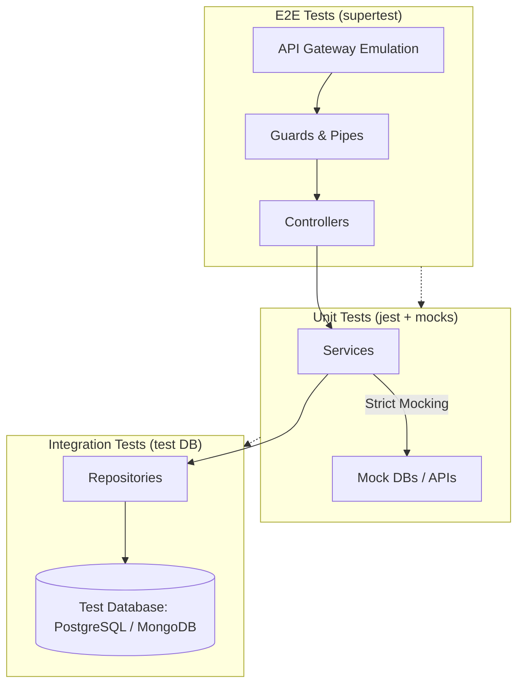

# Testing Strategy & Quality Assurance Architecture

## 1. Overview

This document outlines the testing strategy for the **Innova Backend Serverless** repository, following maximum coverage directives, edge cases handling, and the FSLSM (Felder-Silverman Learning Styles Model) educational logic validation.

## 2. Testing Architecture Diagram



## 3. Strict Unit Testing (100% Core Domain Coverage)

All unit tests are strictly decoupled from external databases using `jest.spyOn()` and mock objects (`mockPrismaService`, `mockMongooseModel`).

### Matrix Coverage
- **Happy Path:** Valid DTOs processing.
- **Validation Failures:** Mismatched inputs routing through `Pipes` returning `BadRequestException`.
- **Edge Cases:** Zeros in telemetry streams, missing data keys, large payload tests.
- **Service Faults:** Simulating `InternalServerErrorException` gracefully.

## 4. Integration Testing (Repository Layer)

Testing database querying mechanisms:
- Runs isolated tests on reproducible containers/instances.
- Ensures all ORM mappings, relations, and constraints align perfectly with the domain context.

## 5. End-to-End (E2E) Testing

Verifying the full lifecycle of HTTP transactions:
- **Framework:** `supertest` with NestJS `Test.createTestingModule()`.
- Simulates API Gateway integrations and ensures accurate Swagger API mapping compliance.

## 6. FSLSM & Adaptive Educational Testing Alignment

Our mock configurations are pre-loaded to evaluate our mathematical educational models:
- **Telemetry Aggregation:** Verifying clicks and time-on-task mathematically resolve active/reflective paradigms.
- **Adaptive Material:** Guarantee mapping of Reflective profiles directly fetching identical tags within Material databases.
- **Fault Tolerance:** Assuring fallback mechanisms are activated when models fault or stream breaks occur.

## 7. CI/CD Integration

Tests are executed via GitHub Actions.
```yaml
jobs:
  test:
    runs-on: ubuntu-latest
    steps:
      - uses: actions/checkout@v3
      - name: Install dependencies
        run: npm ci
      - name: Run Tests
        run: npm run test:e2e && npm run test
```

Ensure `.env.test` is provided inside environments orchestrating test runners.
