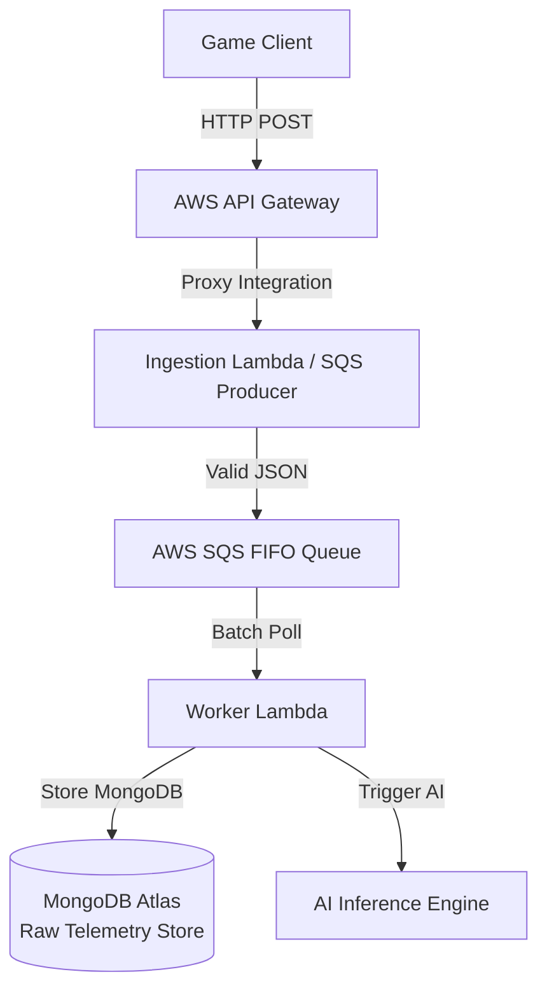

## Polyglot Persistence Architecture (DBML Reference)

We strictly follow a Polyglot Persistence methodology:

1. **[PostgreSQL Profiles ERD (DBML)](docs/postgresql-profiles.dbml)** - Handled via Prisma ORM for structured, consistent `Users` & `FslsmProfiles`.
2. **[MongoDB Telemetry Schema (DBML)](docs/mongodb-telemetry.dbml)** - Handled via Mongoose for raw game metrics (Heavy non-structured JSON payload inserts via `insertMany`), offloading write pressure from PostgreSQL.

## Integration Workflow: NNA to Teacher

1. **NNA Gameplay:** A player generates real-time telemetry (clicks, time, drags).
2. **AWS API Gateway (Ingestion API):** Receives the `RawTelemetry` JSON payload block.
3. **AWS SQS FIFO Queue:** Validated payloads are published asynchronously to prevent bottlenecks.
4. **Lambda Worker:** Dequeues records in batch.
   - Uses `Mongoose` to firehose `.insertMany()` into **MongoDB Atlas**.
   - Triggers Scikit-Learn inference.
5. **Insights / Normalization:** Inference response returns a scaled value (-11 to +11) of the FSLSM profile.
   - `PrismaService` applies an upsert operation specifically mapping `userId` back to the relational structure on **Neon DB**.
6. **Teacher Dashboard Analysis:** Reads the finalized FSLSM indicators instantly from Neon PostgreSQL for material adaptation context.

## Telemetry Ingestion Pipeline

A **Mermaid.js flowchart** depicting the Telemetry Ingestion Pipeline (API Gateway -> SQS FIFO -> Worker Lambda -> MongoDB).

