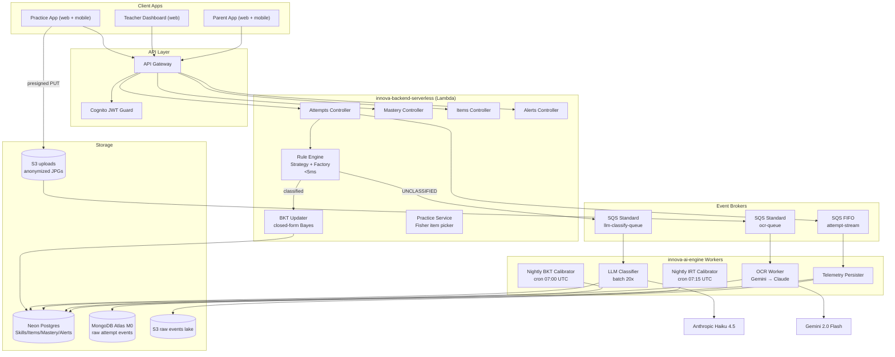
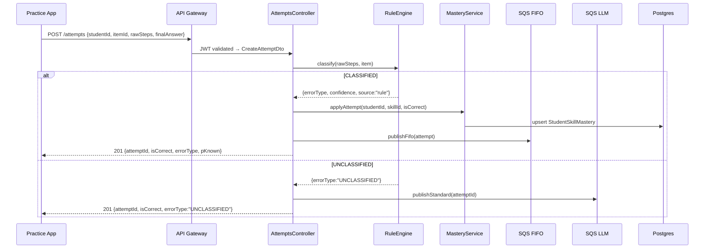

# innova-backend-serverless

> API core del ecosistema **Innova EdTech** — detección de errores matemáticos procedurales, 3°–6° básico chileno.
>
> NestJS · TypeScript strict · Prisma · Neon Postgres · MongoDB Atlas · AWS Lambda + SQS · Cognito

---

## Tabla de contenidos

- [innova-backend-serverless](#innova-backend-serverless)
  - [Tabla de contenidos](#tabla-de-contenidos)
  - [1. Visión general](#1-visión-general)
  - [2. Arquitectura](#2-arquitectura)
  - [3. Stack tecnológico](#3-stack-tecnológico)
  - [4. Dominio y fundamento teórico](#4-dominio-y-fundamento-teórico)
  - [5. Estructura del repositorio](#5-estructura-del-repositorio)
  - [6. Metodología y flujo de trabajo](#6-metodología-y-flujo-de-trabajo)
    - [6.1 GSD / BMAD](#61-gsd--bmad)
    - [6.2 AI usage logs](#62-ai-usage-logs)
    - [6.3 Gitflow](#63-gitflow)
    - [6.4 Quality gates](#64-quality-gates)
  - [7. Variables de entorno](#7-variables-de-entorno)
  - [8. Setup local](#8-setup-local)
    - [Prerrequisitos](#prerrequisitos)
    - [Pasos](#pasos)
    - [Comandos frecuentes](#comandos-frecuentes)
  - [9. Tests y cobertura](#9-tests-y-cobertura)
    - [Suites clave](#suites-clave)
  - [10. Schema de base de datos](#10-schema-de-base-de-datos)
    - [PostgreSQL (Prisma)](#postgresql-prisma)
    - [MongoDB (Mongoose)](#mongodb-mongoose)
  - [11. Endpoints](#11-endpoints)
  - [12. Despliegue (AWS Lambda + Serverless Framework)](#12-despliegue-aws-lambda--serverless-framework)
    - [Prerrequisitos AWS](#prerrequisitos-aws)
    - [Deploy completo](#deploy-completo)
    - [Re-deploy tras cambios](#re-deploy-tras-cambios)
    - [CI/CD (GitHub Actions)](#cicd-github-actions)
  - [13. Costos](#13-costos)
  - [14. Privacidad y cumplimiento NNA](#14-privacidad-y-cumplimiento-nna)
  - [15. Roadmap](#15-roadmap)
  - [16. Recursos](#16-recursos)
  - [17. Licencia](#17-licencia)

---

## 1. Visión general

**Innova** resuelve el dolor validado en 20 entrevistas con docentes chilenos:

> *"El profesor se entera tarde de lo que no está entendiendo el aula."*

Este repositorio es el **backend serverless** que orquesta todo el flujo:

| Responsabilidad | Mecanismo |
|----------------|-----------|
| Recibir intentos de alumnos (digital o foto escaneada) | `POST /attempts` con ValidationPipe |
| Clasificar el tipo de error matemático | Rule Engine Strategy+Factory en-proceso (<5ms) |
| Actualizar probabilidad de dominio del alumno | BKT closed-form Bayesian update |
| Enrutar errores sin clasificar al LLM | SQS Standard → `innova-ai-engine` |
| Persistir eventos de telemetría | SQS FIFO → MongoDB Atlas + S3 |
| Exponer datos al dashboard del profesor | `GET /alerts`, `GET /mastery/:studentId` |
| Recomendar práctica adaptativa | Fisher information item picker |

---

## 2. Arquitectura



Secuencia de ingesta de un intento:



> Diagramas UML formales (componentes, lollipop/socket interfaces, UML Notes con NFRs) en `docs/drawio/`. Guía de construcción en Draw.io: `docs/drawio/01-how-to-draw-high-level-architecture.md`.

---

## 3. Stack tecnológico

| Capa | Tecnología | Versión | Razón |
|------|-----------|---------|-------|
| Lenguaje | TypeScript strict | 5.x | Tipado extremo a extremo, `noImplicitAny` |
| Framework | NestJS | 10+ | DI-first, modular, Guards + Interceptors |
| ORM | Prisma | 5+ | Migrations versionadas, tipos generados |
| DB relacional | Neon Postgres (serverless) | 16 | Auto-suspend idle → $0 fuera de clases |
| DB documental | MongoDB Atlas M0 | 7 | Free tier, raw telemetry sin schema rígido |
| Mensajería | AWS SQS (FIFO + Standard) | — | Durabilidad, ACK/NACK, desacopla LLM costoso |
| Auth | AWS Cognito | — | JWT pools, sin servidor propio |
| Cloud | AWS Lambda + API Gateway | — | Pay-per-request, zero idle cost |
| Deploy | Serverless Framework | 3+ | Multi-function, container images por handler |
| Tests | Jest + Supertest | — | Coverage ≥75%, E2E con DB real |
| Lint/Format | ESLint strict + Prettier | — | `noImplicitAny`, `strictNullChecks` |
| Package manager | pnpm | 9+ | Workspace protocol, eficiencia disco |
| Containers | Docker + Docker Compose | — | Parity local/prod |

---

## 4. Dominio y fundamento teórico

El pipeline de clasificación sigue 4 capas:

**Capa 1 — Rule Engine (síncrono, <5ms)**
Basado en Brown & VanLehn (1980) "Repair Theory": los errores procedurales en aritmética son sistemáticos y catalogables. Se implementan patrones de error por topic usando **Strategy + Factory**. Coverage esperado: 75–85% de intentos reales.

Tipos de error MVP (`subtraction_borrow`):

| Error Type | Descripción |
|-----------|-------------|
| `BORROW_OMITTED_TENS` | Omite el préstamo en columna unidades |
| `BORROW_OMITTED_HUNDREDS` | Omite el préstamo en columna centenas |
| `SUBTRAHEND_MINUEND_SWAPPED` | Resta al revés (sustrayendo mayor del menor) |
| `BORROW_FROM_ZERO_INCORRECT` | Maneja mal el préstamo desde columna con 0 |
| `STOP_BORROW_PROPAGATION` | Detiene propagación del préstamo a media columna |
| `DIGIT_TRANSPOSITION` | Dígitos en el resultado transpuestos |
| `COLUMN_MISALIGNMENT` | Alineación vertical incorrecta |
| `ARITHMETIC_FACT_ERROR` | Error en hechos básicos (off-by-1) |
| `UNCLASSIFIED` | Ninguna regla matchea → SQS LLM queue |

**Capa 2 — BKT Online Update (síncrono, <1ms)**
Basado en Corbett & Anderson (1995). Cuatro parámetros por (alumno, skill):

```
P(Ln | obs=1) = (1−pS)·P(Ln−1) / [(1−pS)·P(Ln−1) + pG·(1−P(Ln−1))]
P(Ln | obs=0) = pS·P(Ln−1)     / [pS·P(Ln−1) + (1−pG)·(1−P(Ln−1))]
P(Ln) = P(Ln−1|obs) + (1 − P(Ln−1|obs)) · pT
```

Parámetros default (Corbett & Anderson 1995): `pL0=0.30, pT=0.10, pS=0.10, pG=0.20`. Recalibración nightly por `innova-ai-engine` vía grid search.

**Capa 3 — IRT 2PL (nightly batch)**
Basado en Lord (1980). Selección óptima del próximo item por Fisher information: maximiza `a²·P(θ)·(1−P(θ))` dado `θ` actual del alumno. Ejecutado en `innova-ai-engine` Lambdas Python.

**Capa 4 — LLM Async Classification (batch 20×)**
Claude Haiku 4.5 con prompt caching (`cache_control: ephemeral`) + `tool_choice` forzado para output estructurado. Los errores `UNCLASSIFIED` van a SQS Standard y son procesados en batches de 20. Latencia: <5min hasta dashboard del profe.

Literatura completa: `.github/instructions/02-estado-del-arte.md`.

---

## 5. Estructura del repositorio

```
innova-backend-serverless/
├── src/
│   ├── app.module.ts
│   ├── main.ts                     # dev entry
│   ├── lambda.ts                   # Lambda entry (@vendia/serverless-express)
│   ├── modules/
│   │   ├── attempts/
│   │   │   ├── attempts.controller.ts   # POST /attempts
│   │   │   ├── attempts.service.ts      # orchestration: rule → BKT → SQS
│   │   │   ├── dto/create-attempt.dto.ts
│   │   │   └── rule-engine/
│   │   │       ├── engine.service.ts    # orquestador de estrategias
│   │   │       ├── factory.ts           # topic → Strategy
│   │   │       └── strategies/
│   │   │           └── subtraction-borrow.strategy.ts  # 9 error types
│   │   ├── mastery/
│   │   │   ├── mastery.controller.ts    # GET /mastery/:studentId
│   │   │   └── mastery.service.ts       # BKT closed-form update
│   │   ├── items/
│   │   │   ├── items.controller.ts
│   │   │   └── items.service.ts
│   │   ├── skills/
│   │   │   ├── skills.controller.ts
│   │   │   └── skills.service.ts
│   │   ├── alerts/
│   │   │   ├── alerts.controller.ts     # GET /alerts, PATCH /alerts/:id/resolve
│   │   │   └── alerts.service.ts
│   │   ├── practice/
│   │   │   ├── practice.controller.ts   # POST /practice/assign
│   │   │   └── practice.service.ts      # Fisher information item picker
│   │   └── auth/
│   │       └── jwt-auth.guard.ts        # Cognito JWKS validation
│   ├── adapters/
│   │   ├── anthropic.adapter.ts         # Haiku 4.5, prompt caching, tool_use
│   │   ├── sqs.adapter.ts               # publishFifo + publishStandard
│   │   ├── cognito.adapter.ts
│   │   └── math-ocr/
│   │       ├── math-ocr.port.ts         # MathOCRPort interface
│   │       ├── gemini-vision.adapter.ts # primary OCR (free tier)
│   │       ├── claude-vision.adapter.ts # fallback OCR
│   │       └── math-ocr.orchestrator.ts # confidence-based escalation ≥0.85
│   ├── infrastructure/
│   │   ├── database/
│   │   │   └── prisma.service.ts        # singleton serverless-safe, lazy connect
│   │   └── workers/
│   │       ├── telemetry-persister.handler.ts  # SQS FIFO → MongoDB + S3
│   │       ├── llm-classifier.handler.ts       # SQS batch-20 → Anthropic → Postgres
│   │       ├── ocr-worker.handler.ts            # S3 ObjectCreated → OCR → Attempt
│   │       └── alert-generator.handler.ts       # cron horaria → TeacherAlert
│   └── shared/
│       ├── interceptors/               # ResponseInterceptor, LoggingInterceptor
│       ├── filters/                    # AllExceptionsFilter
│       └── middleware/                 # TraceIdMiddleware
├── prisma/
│   ├── schema.prisma                   # schema post-pivot completo
│   ├── migrations/
│   └── seed.ts                         # 1 School, 5 Students, 30 Items
├── test/
│   └── app.e2e-spec.ts
├── docs/
│   ├── roadmap.md
│   ├── milestones.md
│   ├── requirements.md
│   ├── architecture.md                 # ADRs 001–010
│   └── error-taxonomy.md               # catálogo completo por topic
├── docker-compose.yml                  # postgres 16 + mongodb 7 local
├── Dockerfile                          # multi-stage Lambda container
├── serverless.yml                      # Lambda functions + SQS + S3 resources
├── .env.example
└── README.md
```

---

## 6. Metodología y flujo de trabajo

> **Lectura obligatoria antes de abrir un PR.** El proyecto sigue GSD/BMAD con uso declarado de agentes IA.

### 6.1 GSD / BMAD

Artefactos vivos en `docs/`:

| Archivo | Propósito |
|---------|-----------|
| `docs/roadmap.md` | Milestones M0–M6, fechas, riesgos |
| `docs/milestones.md` | Sprints, DoR, DoD, ciclos |
| `docs/requirements.md` | RF/NFR trazables |
| `docs/architecture.md` | ADRs con tradeoffs (ADR-001 a ADR-010) |

### 6.2 AI usage logs

Por cada sesión relevante con Claude Code u otro agente:

- Crear `docs/ai-logs/YYYY-MM-DD-<tema>.md`
- Incluir: Prompt exacto · Output resumido · Decisión · Tradeoffs
- Cada PR referencia el AI log que generó esos cambios

### 6.3 Gitflow

```
main (protegida) <── feature/<scope>
                  <── fix/<scope>
                  <── hotfix/<scope>
```

- `main` protegida: PR obligatorio, **≥2 reviewers**, CI verde, no force-push.
- Conventional Commits **en inglés**: `feat(attempts): add rule engine factory`, `fix(bkt): clamp p_known to [0,1]`
- Squash and merge con título Conventional.

### 6.4 Quality gates

| Gate | Criterio | Bloquea merge |
|------|---------|---------------|
| `pnpm build` | exit 0 | ✅ |
| `pnpm lint` | 0 errores | ✅ |
| `pnpm test:cov` | coverage ≥ **75%** | ✅ |
| `pnpm test:e2e` | exit 0 | ✅ |
| Reviewers | 2 aprobados | ✅ |

---

## 7. Variables de entorno

Plantilla en `.env.example`. **Nunca commitear `.env`.**

| Variable | Descripción | Requerida |
|----------|-------------|-----------|
| `DATABASE_URL` | Neon Postgres connection string | ✅ |
| `MONGODB_URI` | MongoDB Atlas M0 connection string | ✅ |
| `COGNITO_USER_POOL_ID` | AWS Cognito User Pool ID | ✅ |
| `COGNITO_CLIENT_ID` | Cognito App Client ID | ✅ |
| `COGNITO_REGION` | AWS region del pool | ✅ |
| `SQS_ATTEMPT_STREAM_URL` | URL SQS FIFO attempt-stream | ✅ |
| `SQS_LLM_CLASSIFY_URL` | URL SQS Standard llm-classify-queue | ✅ |
| `SQS_OCR_QUEUE_URL` | URL SQS Standard ocr-queue | ✅ |
| `AWS_REGION` | Región AWS de los recursos | ✅ |
| `ANTHROPIC_API_KEY` | API key de Anthropic | ✅ (prod) |
| `GEMINI_API_KEY` | API key de Google AI Studio | ✅ (prod) |
| `LOG_LEVEL` | `debug` / `info` / `warn` | ❌ (default: `info`) |

---

## 8. Setup local

### Prerrequisitos

- Node.js ≥20 (recomendado vía `nvm`)
- pnpm ≥9 (`corepack enable && corepack prepare pnpm@latest --activate`)
- Docker + Docker Compose v2
- AWS CLI v2 configurado (o LocalStack para queues locales)

### Pasos

```bash
# 1. Clonar
git clone git@github.com:<org>/innova-backend-serverless.git
cd innova-backend-serverless

# 2. Instalar dependencias
pnpm install

# 3. Variables de entorno
cp .env.example .env
# editar .env con credenciales reales

# 4. Levantar Postgres + MongoDB locales
docker compose up -d

# 5. Aplicar migraciones y seed
pnpm prisma migrate dev
pnpm prisma db seed

# 6. Levantar dev server (hot reload)
pnpm start:dev
# → http://localhost:3000

# 7. Verificar
curl http://localhost:3000/health
curl 'http://localhost:3000/skills'
```

### Comandos frecuentes

```bash
pnpm start:dev          # hot reload
pnpm build              # compilar TypeScript
pnpm prisma studio      # GUI Prisma (admin DB)
pnpm prisma migrate dev --name <name>  # nueva migración

docker compose logs -f  # ver logs Postgres + Mongo
docker compose down     # apagar (mantiene volúmenes)
docker compose down -v  # apagar y borrar datos
```

---

## 9. Tests y cobertura

```bash
# Unitarios
pnpm test

# Con cobertura (gate ≥75%)
pnpm test:cov

# E2E con DB real (requiere DATABASE_URL_TEST en .env)
pnpm test:e2e

# Watch mode
pnpm test:watch
```

### Suites clave

| Suite | Qué verifica |
|-------|-------------|
| `subtraction-borrow.strategy` | 9 tests, 1 por error_type — clasificación correcta con golden set |
| `mastery.service` | `pKnown ∈ [0,1]`, monotonically increases under correct answers (property test) |
| `attempts.controller` (E2E) | POST attempt → DB row creado + SQS message enviado |
| `telemetry.consumer` | Mock SQS event → MongoDB write + S3 put |

Reporte de cobertura: `coverage/lcov-report/index.html`

Ver spec completo: `docs/prompt/01-innova-backend-serverless-testing.md`

---

## 10. Schema de base de datos

### PostgreSQL (Prisma)

```
School            — id, name, region
Classroom         — id, schoolId, name, gradeLevel
Student           — id, cognitoSub, classroomId
Teacher           — id, cognitoSub, classrooms[]
Skill             — id, topic (unique), gradeLevel, prerequisites[]
SkillBKTParams    — skillId (PK), pL0, pTransit, pSlip, pGuess, calibratedAt
Item              — id, skillId, content (Json), irtA, irtB, attemptCount
Attempt           — id, studentId, itemId, rawSteps (Json), errorType?, classifierSource, confidence?
StudentSkillMastery — @@id([studentId, skillId]), pKnown, attemptsCount
TeacherAlert      — id, classroomId, alertType, payload (Json)
PracticeAssignment — id, studentId, itemIds[], reason, assignedAt
```

Schema completo: `prisma/schema.prisma`. DBML documentado: `docs/postgresql.dbml`.

### MongoDB (Mongoose)

```
attempt_events         — raw keystrokes + intermediate steps (replay/debug)
llm_classification_jobs — request, response, cost tracking
```

DBML: `docs/mongodb.dbml`.

---

## 11. Endpoints

| Método | Path | Descripción | Auth |
|--------|------|-------------|------|
| GET | `/health` | Healthcheck | — |
| POST | `/attempts` | Ingestar intento (digital o post-OCR) | JWT |
| GET | `/mastery/:studentId` | Estado BKT actual por skill | JWT |
| GET | `/skills` | Catálogo de skills | JWT |
| GET | `/items` | Item bank con parámetros IRT | JWT |
| GET | `/alerts` | Alertas sin resolver del classroom | JWT |
| PATCH | `/alerts/:id/resolve` | Marcar alerta resuelta | JWT (teacher) |
| POST | `/practice/assign` | Generar PracticeAssignment | JWT (teacher) |
| POST | `/uploads/presigned-url` | Generar presigned URL para foto de cuaderno | JWT |

Todos los endpoints requieren `Authorization: Bearer <cognito-jwt>` excepto `/health`.
Swagger disponible en `http://localhost:3000/api` en modo dev.

---

## 12. Despliegue (AWS Lambda + Serverless Framework)

### Prerrequisitos AWS

1. Cuenta AWS con Free Tier activo.
2. Cognito User Pool + App Client configurados (pools: `Student`, `Teacher`, `Parent`).
3. SQS queues creadas vía `serverless deploy` (FIFO attempt-stream + 2 Standard).
4. Neon Postgres: proyecto creado en [neon.tech](https://neon.tech), free tier.
5. MongoDB Atlas M0: cluster en [cloud.mongodb.com](https://cloud.mongodb.com), free tier.

```bash
# Crear User Pool con MFA para teachers
aws cognito-idp create-user-pool --pool-name innova-teachers \
  --mfa-configuration ON \
  --auto-verified-attributes email

# Obtener JWKS URI (para COGNITO_USER_POOL_ID)
# https://cognito-idp.<REGION>.amazonaws.com/<POOL_ID>/.well-known/jwks.json
```

### Deploy completo

```bash
# Instalar Serverless Framework CLI
pnpm add -g serverless

# Configurar credenciales AWS
aws configure

# Variables de entorno para deploy
export DATABASE_URL="postgresql://..."
export MONGODB_URI="mongodb+srv://..."
export ANTHROPIC_API_KEY="sk-ant-..."
export GEMINI_API_KEY="AIza..."

# Deploy (crea SQS, S3, Lambda functions)
pnpm build
serverless deploy --stage prod
```

### Re-deploy tras cambios

```bash
pnpm build
serverless deploy function -f api --stage prod
```

### CI/CD (GitHub Actions)

`.github/workflows/ci.yml` — se ejecuta en cada PR:

1. `pnpm lint` → `pnpm tsc --noEmit` → `pnpm test:cov`
2. Bloquea merge si coverage < 75%

`.github/workflows/deploy.yml` — se ejecuta en merge a `main`:

1. `pnpm build`
2. `pnpm prisma migrate deploy`
3. `serverless deploy --stage prod`

Secrets requeridos en GitHub:

| Secret | Descripción |
|--------|-------------|
| `DATABASE_URL` | Neon Postgres prod connection string |
| `MONGODB_URI` | Atlas M0 connection string |
| `COGNITO_USER_POOL_ID` | Pool ID de AWS Cognito |
| `COGNITO_CLIENT_ID` | App Client ID |
| `COGNITO_REGION` | Región del pool (e.g. `us-east-1`) |
| `AWS_ACCESS_KEY_ID` | IAM key para deploy |
| `AWS_SECRET_ACCESS_KEY` | IAM secret para deploy |
| `ANTHROPIC_API_KEY` | Claude Haiku 4.5 API key |
| `GEMINI_API_KEY` | Google AI Studio API key |

**Rollback:** `serverless rollback --timestamp <timestamp>` o re-deploy de la versión anterior.

---

## 13. Costos

Proyección: **1000 alumnos activos, 22 días lectivos, ~30 intentos/alumno/día = 660K intentos/mes**

| Componente | Costo/mes |
|-----------|----------|
| API Gateway (660K req) | $2.31 |
| Lambda NestJS handlers | $4.50 |
| SQS FIFO + Standard | $0.41 |
| Neon Postgres (free tier) | $0.00 |
| MongoDB Atlas M0 | $0.00 |
| S3 + CloudFront | $3.50 |
| Anthropic Haiku 4.5 (LLM classifier, con caching) | ~$28.00 |
| Gemini 2.0 Flash Vision (OCR) | ~$99.00 |
| **Total backend** | **~$45/mes** |

Costo por alumno/mes: **~$0.05**. Costo anual por colegio (300 alumnos): **~$162**.

Desglose completo: `.github/instructions/09-costos-y-escalabilidad.md`.

**Killswitches activos:**
- CloudWatch billing alarm a **$80 LLM** → SSM `LLM_PAUSED=true` → Lambda LLM consumer verifica antes de llamar Anthropic → mensajes van a DLQ.
- CloudWatch billing alarm a **$50 OCR** → SSM `OCR_PAUSED=true` → fallback a "carga digital obligatoria".

---

## 14. Privacidad y cumplimiento NNA

- **COPPA + Ley 21.180 (Chile):** cero PII llega al LLM o al OCR provider. Solo `student_uuid` en mensajes SQS.
- Imágenes de worksheets: filename = UUID aleatorio, purgadas a 30 días vía S3 lifecycle policy.
- Cognito JWT requerido en todos los endpoints — sin acceso anónimo.
- `classifierSource` en cada `Attempt` permite auditoría completa: `rule` / `llm` / `human`.
- Consentimiento parental registrado en `ParentLink` antes de habilitar uploads de fotos.
- Datos de menores no se comparten con servicios analíticos de terceros.

---

## 15. Roadmap

| Milestone | Fecha | Entregable |
|-----------|-------|-----------|
| M0 — Spec & Governance | 29 abr | Plan pivot, ADRs, docs BMAD, error-taxonomy |
| M1 — Backend skeleton | 30 abr — 2 may | modules + Prisma migrations + Prisma real + CI |
| **M2 — MVP demo** | **3 may (Entrega 2)** | E2E demo 1 topic subtraction_borrow, 5 alumnos |
| M3 — AI engine | 4–30 may | BKT/IRT nightly + LLM classifier + OCR worker |
| **M4 — Entrega 3** | **7 jun** | 3 topics, coverage ≥75%, pilot real con 5+ alumnos |
| M5 — Polish + Tauri | 8–18 jun | parent app, Tauri desktop, onboarding flow |
| **M6 — Entrega 4** | **19 jun** | Producto en producción para incubadora |

---

## 16. Recursos

- Especificaciones del dominio: `.github/instructions/`
- Fundamento teórico: `.github/instructions/02-estado-del-arte.md`
- Modelo cognitivo BKT/IRT: `.github/instructions/04-modelo-cognitivo.md`
- Pipeline BKT calibración: `.github/instructions/05-pipeline-bkt-irt.md`
- Clasificador LLM: `.github/instructions/06-llm-error-classifier.md`
- OCR Vision pipeline: `.github/instructions/06b-ocr-vision-pipeline.md`
- Costos y escalabilidad: `.github/instructions/09-costos-y-escalabilidad.md`
- Taxonomía de errores: `docs/error-taxonomy.md`
- ADRs: `docs/architecture.md`

---

## 17. Licencia

Innova - Team 23. Internal GPL-3.0 License.
