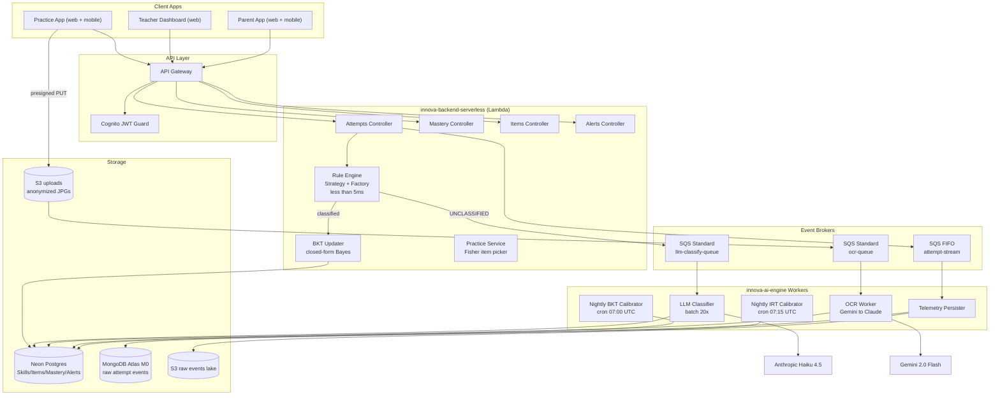

# innova-backend-serverless

> API core del ecosistema **Innova EdTech** — detección de errores matemáticos procedurales, 3°–6° básico chileno.
>
> NestJS · TypeScript strict · Prisma · Neon Postgres · MongoDB Atlas · AWS Lambda + SQS · Cognito

---

## Tabla de contenidos

- [1. Visión general](#1-visión-general)
- [2. Arquitectura](#2-arquitectura)
- [3. Stack tecnológico](#3-stack-tecnológico)
- [4. Dominio y fundamento teórico](#4-dominio-y-fundamento-teórico)
- [5. Estructura del repositorio](#5-estructura-del-repositorio)
- [6. Metodología y flujo de trabajo](#6-metodología-y-flujo-de-trabajo)
- [7. Variables de entorno](#7-variables-de-entorno)
- [8. Setup local](#8-setup-local)
- [9. Tests y cobertura](#9-tests-y-cobertura)
- [10. Schema de base de datos](#10-schema-de-base-de-datos)
- [11. Endpoints](#11-endpoints)
- [12. Despliegue (AWS Lambda + Serverless Framework)](#12-despliegue-aws-lambda--serverless-framework)
- [13. Costos](#13-costos)
- [14. Privacidad y cumplimiento NNA](#14-privacidad-y-cumplimiento-nna)
- [15. Roadmap](#15-roadmap)
- [16. Recursos](#16-recursos)
- [17. Licencia](#17-licencia)

---

## 1. Visión general

**Innova** resuelve el dolor validado en 20 entrevistas con docentes chilenos:

> *"El profesor se entera tarde de lo que no está entendiendo el aula."*

Este repositorio es el **backend serverless** que orquesta todo el flujo:

| Responsabilidad | Mecanismo |
|----------------|-----------|
| Recibir intentos de alumnos (digital o foto escaneada) | `POST /attempts` con ValidationPipe |
| Clasificar el tipo de error matemático | Rule Engine Strategy+Factory en-proceso (<5ms) |
| Actualizar probabilidad de dominio del alumno | BKT closed-form Bayesian update |
| Enrutar errores sin clasificar al LLM | SQS Standard → `innova-ai-engine` |
| Persistir eventos de telemetría | SQS FIFO → MongoDB Atlas + S3 |
| Exponer datos al dashboard del profesor | `GET /alerts`, `GET /mastery/:studentId` |
| Recomendar práctica adaptativa | Fisher information item picker |

---

## 2. Arquitectura



> Diagramas UML formales (componentes, lollipop/socket interfaces, UML Notes con NFRs) en `docs/drawio/`. Guía de construcción en Draw.io: `docs/drawio/01-how-to-draw-high-level-architecture.md`.

---

## 3. Stack tecnológico

| Capa | Tecnología | Versión | Razón |
|------|-----------|---------|-------|
| Lenguaje | TypeScript strict | 5.x | Tipado extremo a extremo, `noImplicitAny` |
| Framework | NestJS | 10+ | DI-first, modular, Guards + Interceptors |
| ORM | Prisma | 5+ | Migrations versionadas, tipos generados |
| DB relacional | Neon Postgres (serverless) | 16 | Auto-suspend idle → $0 fuera de clases |
| DB documental | MongoDB Atlas M0 | 7 | Free tier, raw telemetry sin schema rígido |
| Mensajería | AWS SQS (FIFO + Standard) | — | Durabilidad, ACK/NACK, desacopla LLM costoso |
| Auth | AWS Cognito | — | JWT pools, sin servidor propio |
| Cloud | AWS Lambda + API Gateway | — | Pay-per-request, zero idle cost |
| Deploy | Serverless Framework | 3+ | Multi-function, container images por handler |
| Tests | Jest + Supertest | 29+ | Coverage ≥75%, E2E con DB real |
| Lint/Format | ESLint strict + Prettier | — | `noImplicitAny`, `strictNullChecks` |
| Package manager | pnpm | 9+ | Workspace protocol, eficiencia disco |
| Containers | Docker + Docker Compose | — | Parity local/prod |

---

## 4. Dominio y fundamento teórico

El pipeline de clasificación sigue 3 capas:

**Capa 1 — Rule Engine (síncrono, <5ms)**
Basado en Brown & VanLehn (1980) "Repair Theory": los errores procedurales en aritmética son sistemáticos y catalogables. Se implementan ~80 patrones de error por topic usando **Strategy + Factory**. Coverage esperado: 75–85% de intentos reales.

Tipos de error MVP (`subtraction_borrow`):
`BORROW_OMITTED`, `BORROW_FROM_ZERO_ERROR`, `SIGN_ERROR`, `SUBTRAHEND_MINUEND_SWAPPED`, `PLACE_VALUE_ERROR`, `BASIC_FACT_ERROR`, `PARTIAL_BORROW_ERROR`, `UNCLASSIFIED`

**Capa 2 — BKT Online Update (síncrono, <1ms)**
Basado en Corbett & Anderson (1995). Cuatro parámetros por (alumno, skill):
- `p_L0` — probabilidad prior de dominio
- `p_T` — probabilidad de aprendizaje por intento
- `p_S` — probabilidad de slip (sabe pero falla)
- `p_G` — probabilidad de guess (no sabe pero acierta)

Update closed-form: `P(Ln | obs=1) = (1−pS)·P(Ln−1) / [(1−pS)·P(Ln−1) + pG·(1−P(Ln−1))]`

**Capa 3 — LLM Async (batch 20×, no bloquea HTTP)**
Basado en IRT 2PL — Lord (1980). Los errores `UNCLASSIFIED` van a SQS Standard y son procesados en batches de 20 por Claude Haiku 4.5 en `innova-ai-engine`.

Literatura completa: `.github/instructions/02-estado-del-arte.md`.

---

## 5. Estructura del repositorio

```
innova-backend-serverless/
├── src/
│   ├── app.module.ts
│   ├── main.ts
│   ├── attempts/
│   │   ├── attempts.controller.ts   # POST /attempts
│   │   ├── attempts.service.ts      # orchestration: rule → BKT → SQS
│   │   ├── attempts.service.spec.ts
│   │   └── dto/
│   │       └── create-attempt.dto.ts
│   ├── mastery/
│   │   ├── mastery.controller.ts    # GET /mastery/:studentId
│   │   └── mastery.service.ts       # BKT update + read
│   ├── items/
│   │   ├── items.controller.ts      # CRUD item bank
│   │   └── items.service.ts
│   ├── skills/
│   │   ├── skills.controller.ts
│   │   └── skills.service.ts
│   ├── alerts/
│   │   ├── alerts.controller.ts     # GET /alerts, PATCH /alerts/:id/resolve
│   │   └── alerts.service.ts
│   ├── practice/
│   │   ├── practice.controller.ts   # POST /practice/assign
│   │   └── practice.service.ts      # Fisher information item picker
│   ├── rules-engine/
│   │   ├── rule-engine.factory.ts   # topic → Strategy mapper
│   │   ├── rule-strategy.interface.ts
│   │   └── strategies/
│   │       ├── subtraction-borrow.strategy.ts
│   │       └── addition-carry.strategy.ts
│   ├── adapters/
│   │   └── cognito/
│   │       ├── cognito.guard.ts
│   │       └── current-user.decorator.ts
│   ├── workers/
│   │   └── telemetry/
│   │       ├── telemetry.consumer.ts  # SQS FIFO → Mongo + S3
│   │       └── telemetry.service.ts
│   └── shared/
│       ├── prisma/
│       │   └── prisma.service.ts
│       ├── sqs/
│       │   └── sqs-producer.service.ts
│       └── config/
│           └── config.module.ts       # Joi schema validation
├── prisma/
│   ├── schema.prisma
│   ├── migrations/
│   └── seed.ts                        # 10 skills + 50 items
├── test/
│   └── app.e2e-spec.ts
├── docs/                               # BMAD/GSD artefactos
│   ├── roadmap.md
│   ├── milestones.md
│   ├── requirements.md
│   └── architecture.md
├── docker-compose.yml                  # postgres + mongodb local
├── Dockerfile                          # multi-stage para Lambda container
├── serverless.yml
├── .env.example
└── README.md
```

---

## 6. Metodología y flujo de trabajo

> **Lectura obligatoria antes de abrir un PR.** El proyecto sigue GSD/BMAD con uso declarado de agentes IA.

### 6.1 GSD / BMAD

Artefactos vivos en `docs/`:

| Archivo | Propósito |
|---------|-----------|
| `docs/roadmap.md` | Milestones M0–M6, fechas, riesgos |
| `docs/milestones.md` | Sprints, DoR, DoD, ciclos |
| `docs/requirements.md` | RF/NFR trazables |
| `docs/architecture.md` | ADRs con tradeoffs (ADR-001 a ADR-011) |

### 6.2 AI usage logs

Por cada sesión relevante con Claude Code u otro agente:
- Crear `docs/ai-logs/YYYY-MM-DD-<tema>.md`
- Incluir: Prompt exacto · Output resumido · Decisión · Tradeoffs
- Cada PR referencia el AI log que generó esos cambios

### 6.3 Gitflow

```
main (protegida) <── feature/<scope>
                  <── fix/<scope>
                  <── hotfix/<scope>
```

- `main` protegida: PR obligatorio, **≥2 reviewers**, CI verde, no force-push.
- Conventional Commits **en inglés**: `feat(attempts): add rule engine factory`, `fix(bkt): clamp p_known to [0,1]`
- Squash and merge con título Conventional.

### 6.4 Quality gates

| Gate | Criterio | Bloquea merge |
|------|---------|---------------|
| `pnpm build` | exit 0 | ✅ |
| `pnpm lint` | 0 errores | ✅ |
| `pnpm test:cov` | coverage ≥ **75%** | ✅ |
| `pnpm test:e2e` | exit 0 | ✅ |
| Reviewers | 2 aprobados | ✅ |

---

## 7. Variables de entorno

Plantilla en `.env.example`. **Nunca commitear `.env`.**

| Variable | Descripción | Requerida |
|----------|-------------|-----------|
| `DATABASE_URL` | Neon Postgres connection string | ✅ |
| `MONGODB_URI` | MongoDB Atlas M0 connection string | ✅ |
| `COGNITO_USER_POOL_ID` | AWS Cognito User Pool ID | ✅ |
| `COGNITO_CLIENT_ID` | Cognito App Client ID | ✅ |
| `COGNITO_REGION` | AWS region del pool | ✅ |
| `SQS_ATTEMPT_STREAM_URL` | URL SQS FIFO attempt-stream | ✅ |
| `SQS_LLM_CLASSIFY_URL` | URL SQS Standard llm-classify-queue | ✅ |
| `SQS_OCR_QUEUE_URL` | URL SQS Standard ocr-queue | ✅ |
| `AWS_REGION` | Región AWS de los recursos | ✅ |
| `LOG_LEVEL` | `debug` / `info` / `warn` | ❌ (default: `info`) |

---

## 8. Setup local

### Prerrequisitos

- Node.js ≥20 (recomendado vía `nvm`)
- pnpm ≥9 (`corepack enable && corepack prepare pnpm@latest --activate`)
- Docker + Docker Compose v2
- AWS CLI v2 configurado (o LocalStack para queues locales)

### Pasos

```bash
# 1. Clonar
git clone git@github.com:<org>/innova-backend-serverless.git
cd innova-backend-serverless

# 2. Instalar dependencias
pnpm install

# 3. Variables de entorno
cp .env.example .env
# editar .env con credenciales reales

# 4. Levantar Postgres + MongoDB locales
docker compose up -d

# 5. Aplicar migraciones y seed
pnpm prisma migrate dev
pnpm prisma db seed

# 6. Levantar dev server (hot reload)
pnpm start:dev
# → http://localhost:3000

# 7. Verificar
curl http://localhost:3000/health
curl 'http://localhost:3000/skills'
```

### Comandos frecuentes

```bash
pnpm start:dev          # hot reload
pnpm build              # compilar TypeScript
pnpm prisma studio      # GUI Prisma (admin DB)
pnpm prisma migrate dev --name <name>  # nueva migración

docker compose logs -f  # ver logs Postgres + Mongo
docker compose down     # apagar (mantiene volúmenes)
docker compose down -v  # apagar y borrar datos
```

---

## 9. Tests y cobertura

```bash
# Unitarios
pnpm test

# Con cobertura (gate ≥75%)
pnpm test:cov

# E2E con DB real (requiere DATABASE_URL_TEST en .env)
pnpm test:e2e

# Watch mode
pnpm test:watch
```

### Suites clave

| Suite | Qué verifica |
|-------|-------------|
| `rules-engine` | Golden set de 200 intentos, uno por error type — todos deben clasificar correctamente |
| `mastery.service` | `pKnown ∈ [0,1]`, monotonically increases under correct answers (property test) |
| `attempts.controller` (E2E) | POST attempt → DB row creado + SQS message enviado |
| `telemetry.consumer` | Mock SQS event → MongoDB write + S3 put |

Reporte de cobertura: `coverage/lcov-report/index.html`

Ver spec completo: `docs/prompt/01-innova-backend-serverless-testing.md`

---

## 10. Schema de base de datos

### PostgreSQL (Prisma)

```
Skill            — topic, gradeLevel, prerequisites[]
Item             — skillId, content (Json), irtDifficulty, irtDiscrimination
Attempt          — studentId, itemId, rawSteps (Json), errorType?, classifierSource, confidence?
StudentSkillMastery — @@id([studentId, skillId]), pKnown, pSlip, pGuess, pTransit
TeacherAlert     — classroomId, alertType, payload (Json)
PracticeAssignment — studentId, itemIds[], reason, assignedAt
```

Schema completo: `prisma/schema.prisma`. DBML documentado: `docs/postgresql.dbml`.

### MongoDB (Mongoose)

```
attempt_events         — raw keystrokes + intermediate steps (replay/debug)
llm_classification_jobs — request, response, cost tracking
```

DBML: `docs/mongodb.dbml`.

---

## 11. Endpoints

| Método | Path | Descripción | Auth |
|--------|------|-------------|------|
| GET | `/health` | Healthcheck | — |
| POST | `/attempts` | Ingestar intento (digital o post-OCR) | JWT |
| GET | `/mastery/:studentId` | Estado BKT actual por skill | JWT |
| GET | `/skills` | Catálogo de skills | JWT |
| GET | `/items` | Item bank con parámetros IRT | JWT |
| GET | `/alerts` | Alertas sin resolver del classroom | JWT |
| PATCH | `/alerts/:id/resolve` | Marcar alerta resuelta | JWT (teacher) |
| POST | `/practice/assign` | Generar PracticeAssignment | JWT (teacher) |

Todos los endpoints requieren `Authorization: Bearer <cognito-jwt>` excepto `/health`.

---

## 12. Despliegue (AWS Lambda + Serverless Framework)

### Prerrequisitos AWS

1. Cuenta AWS con Free Tier activo.
2. ECR repository creado: `aws ecr create-repository --repository-name innova-backend`.
3. Cognito User Pool + App Client configurados.
4. SQS queues creadas (FIFO + 2 Standard).
5. Neon Postgres: proyecto creado en [neon.tech](https://neon.tech), free tier.

### Deploy completo

```bash
# Build container image
docker build -t innova-backend .

# Tag y push a ECR
aws ecr get-login-password --region us-east-1 | \
  docker login --username AWS --password-stdin <account>.dkr.ecr.us-east-1.amazonaws.com

docker tag innova-backend:latest \
  <account>.dkr.ecr.us-east-1.amazonaws.com/innova-backend:latest

docker push <account>.dkr.ecr.us-east-1.amazonaws.com/innova-backend:latest

# Deploy vía Serverless Framework
pnpm serverless deploy --stage prod
```

### Re-deploy tras cambios

```bash
git pull origin main
pnpm build
pnpm serverless deploy function -f attemptsHandler --stage prod
```

### CI/CD (GitHub Actions)

`.github/workflows/ci.yml` — se ejecuta en cada PR:
1. `pnpm lint` → `pnpm tsc --noEmit` → `pnpm test:cov`
2. Bloquea merge si coverage < 75%

`.github/workflows/deploy.yml` — se ejecuta en merge a `main`:
1. Build container → push ECR
2. `serverless deploy --stage prod`

---

## 13. Costos

Proyección: **1000 alumnos activos, 22 días lectivos, ~30 intentos/alumno/día = 660K intentos/mes**

| Componente | Costo/mes |
|-----------|----------|
| API Gateway (660K req) | $2.31 |
| Lambda NestJS handlers | $4.50 |
| SQS FIFO + Standard | $0.41 |
| Neon Postgres (free tier) | $0.00 |
| MongoDB Atlas M0 | $0.00 |
| S3 + CloudFront | $3.50 |
| **Total backend** | **~$11** |

AI engine adicional (LLM + OCR): ~$30/mes. Total plataforma completa: **~$44/mes** en Neon free tier.

Costo por alumno/mes: **~$0.04**. Costo anual por colegio (300 alumnos): **~$160**.

Desglose completo: `.github/instructions/09-costos-y-escalabilidad.md`.

**Killswitches activos:** CloudWatch billing alarm a $80 → pausa automática de Lambdas LLM/OCR. SSM Parameters `/innova/llm/paused` y `/innova/ocr/paused` controlados por `innova-ai-engine`.

---

## 14. Privacidad y cumplimiento NNA

- **COPPA + Ley 21.180 (Chile):** cero PII llega al LLM. Solo `student_uuid` (UUID) en mensajes SQS.
- Imágenes de worksheets: filename = UUID aleatorio, EXIF stripped antes del upload a S3.
- Cognito JWT requerido en todos los endpoints — sin acceso anónimo.
- `classifierSource` en cada `Attempt` permite auditoría completa (rule / llm / human).
- Datos de menores no se comparten con terceros analíticos.

---

## 15. Roadmap

| Milestone | Fecha | Entregable |
|-----------|-------|-----------|
| M0 — Spec & Governance | 29 abr | Plan pivot, ADRs, docs BMAD, error-taxonomy |
| M1 — Refactor instructions | 30 abr | 10 instruction files + prompts + drawio |
| **M2 — Backend skeleton** | **3 may (Entrega 2)** | modules attempts/mastery/items/skills/alerts/practice + Prisma migrations + CI |
| M3 — AI engine | 17 may | bkt/ + irt/ + llm_classifier/ + OCR worker |
| M4 — Frontend | 7 jun (Entrega 3) | apps/practice + apps/teacher + apps/parent |
| M5 — Integration pilot | 12 jun | E2E real con curso piloto (~20 alumnos) |
| M6 — Hardening | 19 jun (Entrega 4) | CloudWatch alarms, cost monitoring, IRT pipeline automatizado |

---

## 16. Recursos

- Especificaciones del dominio: `.github/instructions/`
- Fundamento teórico: `.github/instructions/02-estado-del-arte.md`
- Modelo cognitivo BKT/IRT: `.github/instructions/04-modelo-cognitivo.md`
- Pipeline BKT calibración: `.github/instructions/05-pipeline-bkt-irt.md`
- Clasificador LLM: `.github/instructions/06-llm-error-classifier.md`
- OCR Vision pipeline: `.github/instructions/06b-ocr-vision-pipeline.md`
- Costos y escalabilidad: `.github/instructions/09-costos-y-escalabilidad.md`
- Taxonomía de errores: `docs/error-taxonomy.md`
- ADRs: `docs/architecture.md`

---

## 17. Licencia

MIT
