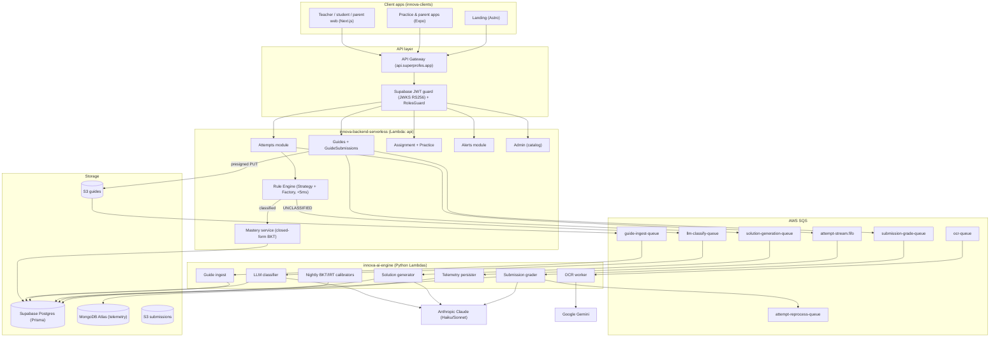
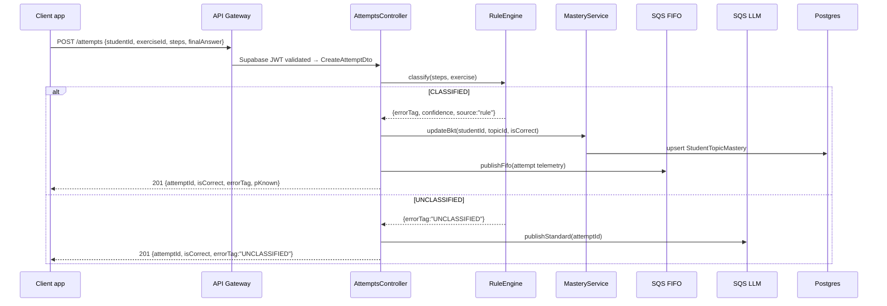

# innova-backend-serverless

> Core API of the **SuperProfe / Innova** EdTech platform: procedural math-error detection for the Chilean
> school curriculum. Live in production at **https://api.superprofes.app**.
>
> NestJS 11 · TypeScript strict · Prisma 7 · Supabase (Auth + Postgres) · MongoDB Atlas · AWS Lambda + SQS + S3 · Serverless Framework

---

## Table of contents

- [1. Overview](#1-overview)
- [2. Architecture](#2-architecture)
- [3. Tech stack](#3-tech-stack)
- [4. Domain and theoretical foundation](#4-domain-and-theoretical-foundation)
- [5. Repository structure](#5-repository-structure)
- [6. Data model](#6-data-model)
- [7. Environment variables](#7-environment-variables)
- [8. Local setup](#8-local-setup)
- [9. Testing and coverage](#9-testing-and-coverage)
- [10. API surface](#10-api-surface)
- [11. Production deployment](#11-production-deployment)
- [12. Cost and killswitches](#12-cost-and-killswitches)
- [13. Privacy and compliance](#13-privacy-and-compliance)
- [14. Methodology and workflow](#14-methodology-and-workflow)
- [15. License](#15-license)

---

## 1. Overview

This repository is the **serverless backend** that orchestrates the whole SuperProfe flow. A teacher uploads
a worksheet (PDF), the system extracts each question and proposes a step-by-step solution key; the student
solves it and uploads a photo of their handwritten work; the system transcribes the photo, aligns it with the
key and classifies the **specific procedural error** (not just right/wrong), then updates a per-student,
per-topic mastery profile and raises alerts for the teacher.

| Responsibility | Mechanism |
|----------------|-----------|
| Authenticate every request | Supabase JWT (JWKS, RS256) guard + role claims |
| Ingest student attempts (digital or photo) | `POST /attempts` with `ValidationPipe` + typed DTOs |
| Classify the procedural error | In-process Rule Engine (Strategy + Factory, <5 ms) |
| Update the student's mastery probability | BKT closed-form Bayesian update |
| Route unclassified errors to the LLM | SQS Standard → `innova-ai-engine` |
| Ingest teacher worksheets (PDF) | `POST /guides` presigned upload → SQS `guide-ingest` |
| Generate exercises / grade submissions | SQS queues consumed by `innova-ai-engine` workers |
| Persist telemetry events | SQS FIFO → MongoDB Atlas + S3 |
| Expose data to the teacher dashboard | `GET /alerts`, `GET /mastery/:studentId`, etc. |
| Recommend adaptive practice | Fisher-information item picker (IRT) |

The heavy AI work (PDF extraction, OCR, LLM classification, BKT/IRT calibration, exercise generation) runs in
the **`innova-ai-engine`** repo. This backend invokes it asynchronously through SQS and shared S3 buckets.

---

## 2. Architecture



Attempt ingestion sequence:



> Formal UML diagrams (components, lollipop/socket interfaces, NFR notes) live in `../docs/drawio/`.

---

## 3. Tech stack

| Layer | Technology | Why |
|-------|-----------|-----|
| Language | TypeScript (strict) | `noImplicitAny`, `strictNullChecks`, `exactOptionalPropertyTypes` |
| Framework | NestJS 11 | DI-first, modular, Guards + Interceptors |
| ORM | Prisma 7 (`@prisma/adapter-pg` + `pg`) | Versioned migrations, generated types, serverless-friendly |
| Relational DB | Supabase Postgres | Managed Postgres; transaction pooler for serverless |
| Document DB | MongoDB Atlas | Raw, schema-less attempt telemetry |
| Messaging | AWS SQS (FIFO + Standard) | Durable, decouples expensive AI work |
| Object storage | AWS S3 | Worksheet PDFs and submission photos |
| Auth | Supabase Auth (JWKS, RS256) | JWT validation against Supabase JWKS; role claims |
| Email | Resend | Password recovery and account notifications |
| Validation | class-validator / class-transformer + Zod | Typed DTOs, no raw `req.body` |
| Cloud | AWS Lambda + API Gateway | Pay-per-request, zero idle cost |
| Deploy | Serverless Framework 3 (esbuild) | One service, multiple functions, custom domain |
| Logging | Pino (`nestjs-pino`) | Structured JSON logs with trace ids |
| API docs | Swagger (`@nestjs/swagger`) | OpenAPI UI at `/docs` |
| Tests | Jest + Supertest | Unit + E2E, coverage gate ≥75% |
| Package manager | pnpm 9 | Workspace protocol, disk efficiency |

---

## 4. Domain and theoretical foundation

The classification pipeline has four layers:

**Layer 1 — Rule Engine (synchronous, <5 ms).** Based on Brown & VanLehn (1980) "Repair Theory": procedural
arithmetic errors are systematic and catalogable. Implemented as one **Strategy class per topic** wired by a
**Factory** (`topic.code → RuleStrategy`). Deterministic subdomains (integer/fraction/decimal operations,
ratios/percentages, linear equations, powers/roots) are classified here. Target coverage: ≥75% of real
attempts classified as non-`UNCLASSIFIED`.

**Layer 2 — BKT online update (synchronous, <1 ms).** Based on Corbett & Anderson (1995). Closed-form
Bayesian update of `pKnown` per `(student, topic)`:

```
P(known | obs=1) = (1-pSlip)·pKnown / [(1-pSlip)·pKnown + pGuess·(1-pKnown)]
P(known | obs=0) =      pSlip·pKnown / [pSlip·pKnown + (1-pGuess)·(1-pKnown)]
P(Ln)           = P(known | obs) + (1 - P(known | obs))·pTransit
```

Default init `pL0=0.30, pT=0.10, pS=0.10, pG=0.20`. Nightly recalibration runs in `innova-ai-engine` and
writes the parameters back to Postgres.

**Layer 3 — IRT 2PL (nightly batch).** Based on Lord (1980). The next exercise is chosen by maximizing Fisher
information `a²·P(θ)·(1−P(θ))` at the student's current `θ`. Calibration runs in `innova-ai-engine`.

**Layer 4 — LLM async classification.** Attempts marked `UNCLASSIFIED` are pushed to SQS and classified by
Claude in `innova-ai-engine` against a proprietary taxonomy of 2,600+ procedural errors aligned to the Chilean
curriculum, with prompt caching and forced structured output.

**Guides pipeline (v9).** Beyond single attempts, the backend drives the teacher-worksheet flow: PDF upload
(`guide-ingest`) → solution-key generation (`solution-generation`) → student photo grading
(`submission-grade`) → reprocessing into attempts (`attempt-reprocess`). Each stage is an SQS queue consumed
by an `innova-ai-engine` worker.

---

## 5. Repository structure

```
innova-backend-serverless/
├── src/
│   ├── main.ts                     # local dev entry (nest start)
│   ├── lambda.ts                   # Lambda entry (@vendia/serverless-express)
│   ├── app.module.ts
│   ├── modules/
│   │   ├── auth/                   # Supabase JWT strategy, RolesGuard, @CurrentUser, email (Resend)
│   │   ├── attempts/               # POST /attempts → rule engine → BKT → SQS
│   │   │   └── rule-engine/        # Strategy + Factory + per-topic strategies
│   │   ├── mastery/                # GET /mastery/:studentId — BKT state
│   │   ├── items/                  # exercise bank + IRT params
│   │   ├── skills/                 # topic/skill catalog
│   │   ├── guides/                 # teacher worksheets: upload, ingest, solution review
│   │   ├── guide-submissions/      # student photo submissions + grading status
│   │   ├── assignment/             # Assignment generation (manual + recommender)
│   │   ├── practice/               # Fisher-information practice picker
│   │   ├── alerts/                 # teacher alerts CRUD
│   │   ├── classrooms/             # courses, invites, enrollment
│   │   ├── parent/                 # parent links + child summaries
│   │   └── admin/                  # error-catalog admin (keyset paginated, @Roles ADMIN)
│   ├── adapters/                   # SQS, S3, Anthropic/Gemini, math-OCR ports
│   ├── infrastructure/
│   │   ├── database/               # PrismaService (serverless-safe singleton)
│   │   └── workers/                # SQS/S3/cron Lambda handlers
│   └── shared/                     # interceptors, filters, middleware (trace id), config
├── prisma/
│   ├── schema.prisma               # full v9 schema (see §6)
│   ├── migrations/
│   └── seed.ts                     # demo school, courses, students, exercises
├── scripts/
│   ├── import-error-catalog.ts     # import ai-engine taxonomy → ErrorTag
│   ├── codegen-error-tags.ts       # generate rule-engine error enums from catalog
│   ├── seed-supabase-auth.ts       # create demo auth users (Admin REST, idempotent)
│   └── local-reprocess-consumer.ts # local SQS consumer for the attempt-reprocess loop
├── test/                           # E2E (jest-e2e.json)
├── docker-compose.yml              # MongoDB 7 + LocalStack (SQS/S3) for local dev
├── serverless.yml                  # 6 Lambda functions + SQS/S3 resources + custom domain
├── .env.example
└── README.md
```

---

## 6. Data model

**Postgres (Prisma, `prisma/schema.prisma`).** The v9 schema is curriculum-first and multi-subject:

- Identity & roles: `User` (`supabaseUid`), `Teacher`, `Student`, `Parent`, `ParentLink`.
- Org & courses: `Organization`, `School`, `Course`, `CourseTeacher`, `Enrollment`, `ClassroomInvite`.
- Curriculum: `Subject`, `Curriculum`, `OfficialOACode`, `Unit`, `Topic`, `TopicPrerequisite`,
  `Domain`, `Subdomain`.
- Exercises & work: `Exercise` (`source: SYSTEM | TEACHER_AUTHORED | LLM_GENERATED`), `Assignment`,
  `AssignmentTarget`, `AssignmentExercise`, `Attempt`, `AttemptStep`, `AttemptErrorReport`.
- Mastery & alerts: `StudentTopicMastery` (with `trend7d`), `TeacherAlert`, `ErrorTag` (source of truth for
  error types, synced with the ai-engine taxonomy).
- Guides: `Guide`, `GuideQuestion`, `GuideSolution`, `GuideSubmission`.
- Integrations & cost: `SchoolIntegration`, `ExternalIdMap` (e.g. Google Classroom roster), `CostEvent`
  (per-operation AI cost accounting).

Enums: `ErrorSource`, `ErrorStatus`, `ErrorSeverity`, `GuideStatus`, `GuideQuestionStatus`,
`SolutionSource`, `SubmissionStatus`.

**MongoDB (Mongoose).** Raw, high-volume, schema-less telemetry: attempt events (keystrokes / intermediate
steps for replay and debugging) and AI job audit records (request, response, cost tracking).

---

## 7. Environment variables

Template in `.env.example`. **Never commit `.env`.** Config is validated at boot via `@nestjs/config`.

| Variable | Description | Required |
|----------|-------------|----------|
| `DATABASE_URL` | Supabase Postgres connection string. **Prod (serverless):** transaction pooler `:6543` + `?pgbouncer=true&connection_limit=1`. **Local:** local Postgres or Supabase. | ✅ |
| `MONGODB_URI` | MongoDB Atlas / local telemetry connection string | ✅ |
| `SUPABASE_URL` | `https://<project>.supabase.co` | ✅ |
| `SUPABASE_SERVICE_ROLE_KEY` | Server-only admin key (bypasses RLS) | ✅ |
| `SUPABASE_ANON_KEY` | Public anon key | optional |
| `AWS_REGION` | AWS region of the resources (`us-east-1`) | ✅ |
| `SQS_ATTEMPT_STREAM_URL` | FIFO telemetry queue | ✅ |
| `SQS_LLM_CLASSIFY_URL` | LLM classification queue | ✅ |
| `SQS_OCR_QUEUE_URL` | OCR queue | ✅ |
| `SQS_ATTEMPT_REPROCESS_URL` | OCR → attempts reprocess loop | ✅ |
| `SQS_GUIDE_INGEST_URL` | v9 guide ingest queue | prod |
| `SQS_SOLUTION_GEN_URL` | v9 solution generation queue | prod |
| `SQS_SUBMISSION_GRADE_URL` | v9 submission grading queue | prod |
| `S3_GUIDES_BUCKET` / `S3_SUBMISSIONS_BUCKET` | S3 buckets for PDFs / photos | prod |
| `GUIDES_PRESIGNED_PUT_TTL` / `GUIDES_PRESIGNED_GET_TTL` | Presigned URL TTLs (seconds) | optional |
| `RESEND_API_KEY` / `RESEND_FROM_EMAIL` | Email provider (required for password recovery in prod) | prod |
| `PUBLIC_APP_URL` / `PUBLIC_API_URL` | Public URLs used in emails and links | prod |
| `CORS_ORIGINS` | Comma-separated browser origins (e.g. `https://superprofes.app,https://app.superprofes.app`) | prod |
| `ANTHROPIC_API_KEY` / `GEMINI_API_KEY` | AI providers (only for OCR/LLM features) | prod |
| `LOG_LEVEL` | `debug` / `info` / `warn` | optional (default `info`) |

---

## 8. Local setup

### Prerequisites

- Node.js ≥20 (via `nvm`)
- pnpm ≥9 (`corepack enable && corepack prepare pnpm@latest --activate`)
- Docker + Docker Compose v2
- A Supabase project (for Auth + Postgres) or a local Postgres instance

### Steps

```bash
# 1. Install dependencies
pnpm install

# 2. Environment
cp .env.example .env
# edit .env: Supabase keys, DATABASE_URL, MONGODB_URI, queue URLs (LocalStack), AI keys (optional)

# 3. Start local infra: MongoDB 7 + LocalStack (SQS/S3)
docker compose up -d

# 4. Apply migrations + seed (run these yourself; see note below)
pnpm prisma migrate dev
pnpm prisma db seed          # demo school, courses, students, exercises
pnpm seed:full               # seed + import the ai-engine error catalog

# 5. Dev server (hot reload)
pnpm start:dev               # → http://localhost:3000

# 6. Verify
curl http://localhost:3000/health      # 200 OK
# Swagger UI → http://localhost:3000/docs
```

> `docker-compose.yml` provides **MongoDB** and **LocalStack** (SQS/S3). Postgres is expected from Supabase
> or a local instance — point `DATABASE_URL` accordingly (the `.env.example` shows a local Postgres on
> `:5433`). LocalStack lets you exercise the SQS/S3 flows without real AWS.

### Demo auth users

`pnpm seed:auth` (guarded by `ALLOW_SEED=1` + `SEED_DEMO_PASSWORD`) creates the demo identities in Supabase
Auth idempotently via the Admin REST API, so the local DB and Supabase Auth stay in sync.

### Local reprocess consumer

The OCR → attempts loop needs a consumer. In local dev run `pnpm consume:reprocess` to drain the
`attempt-reprocess` queue against LocalStack.

### Frequent commands

```bash
pnpm start:dev          # hot reload
pnpm build              # nest build
pnpm prisma studio      # DB GUI
pnpm prisma migrate dev --name <name>   # new migration
docker compose logs -f  # infra logs
docker compose down -v  # stop and wipe local data
```

---

## 9. Testing and coverage

```bash
pnpm test               # unit
pnpm test:cov           # coverage (gate ≥75%)
pnpm test:e2e           # E2E (requires a test DB; see test/jest-e2e.json)
pnpm test:watch         # watch mode
```

Key suites: rule-engine strategies (one golden case per error type), `MasteryService.updateBkt` (property
tests: `pKnown ∈ [0,1]`, monotonic under repeated correct answers), `AttemptsController` E2E (POST attempt →
DB row + SQS message), telemetry/reprocess consumers (mock SQS events). Coverage report at
`coverage/lcov-report/index.html`.

---

## 10. API surface

REST, JSON, all routes behind the Supabase JWT guard except `/health`. Browse the full, always-current
contract in **Swagger UI at `/docs`** (dev). Representative endpoints:

| Method | Path | Description | Auth |
|--------|------|-------------|------|
| GET | `/health` | Healthcheck | public |
| POST | `/attempts` | Ingest an attempt (digital or post-OCR) | JWT |
| GET | `/attempts/:id/status` | Poll grading/classification status | JWT |
| GET | `/mastery/:studentId` | Current BKT state per topic | JWT |
| GET | `/skills` · `/items` | Topic catalog / exercise bank | JWT |
| POST | `/guides` | Create a guide + presigned PDF upload | JWT (teacher) |
| GET | `/guides/:id` | Guide + extracted questions + solution key | JWT (teacher) |
| POST | `/items/generate` | Enqueue LLM exercise generation | JWT (teacher) |
| POST | `/practice/assign` | Create an assignment | JWT (teacher) |
| GET | `/alerts` · PATCH `/alerts/:id/resolve` | Teacher alerts | JWT (teacher) |
| GET/POST | `/classrooms/*` | Courses, invites, join | JWT |
| GET | `/admin/error-tags` · PATCH status | Error-catalog admin | JWT (ADMIN) |

**Lambda functions (`serverless.yml`):** `api` (HTTP), `telemetryWorker` (SQS FIFO → Mongo/S3),
`llmClassifierWorker`, `ocrWorker`, `alertGenerator` (cron), `attemptReprocessWorker`.

---

## 11. Production deployment

Production runs on **AWS account `751871643325`, region `us-east-1`**, fronted by the custom domain
`api.superprofes.app`. The authoritative step-by-step runbook is `../docs/DEPLOY_RUNBOOK.md`.

### Mechanism

- **Serverless Framework** (`serverless.yml`) deploys one service with six functions plus the SQS queues, S3
  buckets and custom domain mapping (`provider.runtime: nodejs20.x`, esbuild bundling). This stack **owns**
  the SQS queues and S3 buckets that `innova-ai-engine` later consumes, which is why the deploy order is
  **backend → ai-engine → clients**.
- **CI/CD**: `.github/workflows/ci.yml` runs type-check + lint + tests on every PR (coverage gate).
  `.github/workflows/deploy.yml` runs on merge to `main` and deploys to AWS. `.github/workflows/seed-prod.yml`
  is a manual, dispatch-only workflow to seed the demo identities in prod.

### Deploy

```bash
# Local/manual deploy (CI does this automatically on merge to main)
pnpm build
pnpm prisma migrate deploy
npx serverless deploy --stage prod
```

### Production configuration notes

- **`DATABASE_URL` pooler:** the backend (Prisma serverless) must use the Supabase **transaction pooler
  (`:6543`)** with `?pgbouncer=true&connection_limit=1`. The `innova-ai-engine` must use the **session pooler
  (`:5432`)** instead, because `asyncpg` breaks with the transaction pooler's prepared statements.
- **`CORS_ORIGINS`:** browser origins only (`https://superprofes.app,https://app.superprofes.app`). Do not
  add `ai.superprofes.app` (it is server-side Lambda, it does not make CORS requests).
- **Secrets** live in GitHub Actions repository secrets: `SUPABASE_URL/ANON_KEY/SERVICE_ROLE_KEY`,
  `DATABASE_URL`, `MONGODB_URI`, `AWS_ACCESS_KEY_ID/SECRET_ACCESS_KEY/REGION`, `ANTHROPIC_API_KEY`,
  `GEMINI_API_KEY`, `RESEND_API_KEY/FROM_EMAIL`, `PUBLIC_API_URL/APP_URL`, `SEED_DEMO_PASSWORD`.
- **Verify:** `curl -s https://api.superprofes.app/health` → `200 OK`.

### Release flow

After merging the release PR (`develop` → `main`) and a successful deploy, back-merge `main` → `develop` and
create the GitHub release/tag (see `../docs/DEPLOY_RUNBOOK.md` §5–6).

---

## 12. Cost and killswitches

The architecture keeps marginal cost near zero when idle (pay-per-request Lambda, pooled serverless
Postgres). The dominant variable cost is AI inference (OCR + LLM), tracked per operation in the `CostEvent`
table. Billing alarms in CloudWatch flip SSM flags (`LLM_PAUSED`, `OCR_PAUSED`) that the workers check before
calling a provider; when paused, messages go to the DLQ or fall back to digital-only input. Email cost is
negligible; Resend is the single provider to avoid configuration branches.

---

## 13. Privacy and compliance

- No PII reaches the LLM or OCR providers: SQS messages carry only `student_uuid`.
- Submission photos use random UUID filenames and are purged by an S3 lifecycle policy.
- Every request requires a Supabase JWT; there is no anonymous access.
- Each `Attempt` records its `classifierSource` (`rule` / `llm` / `human`) for full auditability.
- Parental consent is recorded in `ParentLink` before photo uploads are enabled.
- Minors' data is not shared with third-party analytics services. Aligned with COPPA and Chile's Law 21.180.

---

## 14. Methodology and workflow

The project follows GSD/BMAD with declared AI-agent usage. Living artifacts are in `../docs/`
(`roadmap.md`, `milestones.md`, `requirements.md`, `architecture.md`) and per-session AI logs in
`../docs/ai-logs/`.

Gitflow: `develop` is the integration branch; `main` is protected (PR + review + green CI, no force-push).
Commits follow **Conventional Commits in English** (`feat(attempts): ...`, `fix(bkt): ...`). Quality gates
that block merge: `pnpm build`, `pnpm lint`, `pnpm test:cov` (≥75%), `pnpm test:e2e`.

---

## 15. License

Innova — Team 23. Internal GPL-3.0 license.
