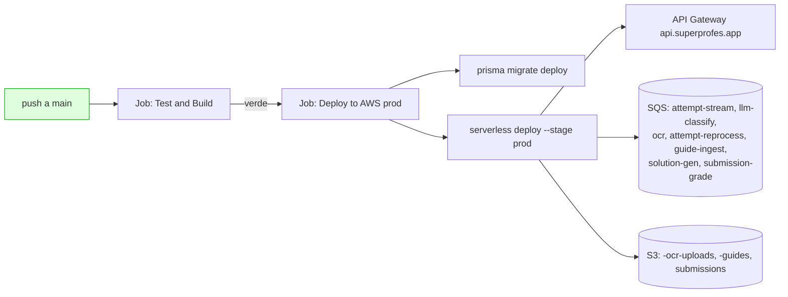

# Deploy & CI/CD — innova-backend-serverless (AWS Lambda + Serverless v3)

> NestJS + Prisma + Mongoose desplegado como **Lambda contenedores** vía Serverless Framework v3.
> Dominio prod: **`https://api.superprofes.app`** · Swagger: **`https://api.superprofes.app/docs`**.
> Última revisión: 2026-06-14.

---

## 1. Arquitectura de deploy



> 🔑 **Este stack es el DUEÑO de las colas SQS y buckets S3** que consume `innova-ai-engine`.
> Por eso **se deploya PRIMERO**: sus outputs (ARNs de colas) son inputs de los secrets de ai-engine.

`deploy.yml` tiene 2 jobs: **Test and Build** (ahora con Postgres+Mongo self-contained) y
**Deploy to AWS (prod)** (`needs: test-and-build`). Si el primero falla, el deploy queda *Skipped*.

---

## 2. Política de ramas

- CI (`ci.yml`) corre en `main`, `feature/**`, `fix/**` y PRs.
- **Deploy SOLO en `main`** (`deploy.yml`). ✅ ya correcto, no tocar.
- Flujo: `feature/<n>` → PR → `develop` → PR → `main`.

---

## 3. Secrets de GitHub Actions

📍 `https://github.com/vruizz22/innova-backend-serverless/settings/secrets/actions`

### 3.1 AWS (deploy)

| Secret | Qué es | Dónde obtenerlo |
|---|---|---|
| `AWS_ACCESS_KEY_ID` | Key del IAM user de deploy | AWS Console → **IAM → Users → (deploy-user) → Security credentials → Create access key**. Permisos: Lambda, API Gateway, CloudFormation, ECR, SQS, S3, IAM passrole, SSM, Route53/ACM (para custom domain) |
| `AWS_SECRET_ACCESS_KEY` | Secret del par anterior | Solo se muestra al crearla |
| `AWS_REGION` | Región | `us-east-1` |

### 3.2 Bases de datos

| Secret | Qué es | Dónde obtenerlo |
|---|---|---|
| `DATABASE_URL` | Postgres de Supabase (pooler) | supabase.com → proyecto → **Settings → Database → Connection string → URI** (usa el de **Connection pooling**, puerto 6543, para Lambda) |
| `MONGODB_URI` | MongoDB Atlas M0 | cloud.mongodb.com → cluster → **Connect → Drivers** → copia el SRV con user/pass |

### 3.3 Supabase Auth (JWKS) — ⚠️ HOY FALTAN

| Secret | Qué es | Dónde obtenerlo |
|---|---|---|
| `SUPABASE_URL` | URL del proyecto | Supabase → **Settings → Data API → Project URL** |
| `SUPABASE_SERVICE_ROLE_KEY` | Clave admin (bypass RLS) | Supabase → **Settings → API Keys → service_role** |
| `SUPABASE_ANON_KEY` | Clave pública | Supabase → **Settings → API Keys → anon** |

> El guard valida JWT contra `https://<ref>.supabase.co/auth/v1/.well-known/jwks.json`.
> Hoy el repo solo tiene `COGNITO_*` (obsoletos) → el deploy resuelve estos a `''` y la auth
> queda rota en runtime. **Agrégalos.**

### 3.4 URLs / CORS / Email

| Secret | Qué es | Valor típico |
|---|---|---|
| `PUBLIC_API_URL` | URL pública de la API | `https://api.superprofes.app` |
| `PUBLIC_APP_URL` | URL del front | `https://app.superprofes.app` |
| `PUBLIC_PRACTICE_URL` | (legacy, opcional) | `https://app.superprofes.app/practice` |
| `CORS_ORIGINS` | Orígenes permitidos (coma) | `https://app.superprofes.app,https://superprofes.app` |
| `RESEND_API_KEY` | Envío de emails | resend.com → **API Keys → Create** |
| `RESEND_FROM_EMAIL` | Remitente verificado | `no-reply@superprofes.app` (dominio verificado en Resend) |

### 3.5 IA

| Secret | Dónde |
|---|---|
| `ANTHROPIC_API_KEY` | console.anthropic.com → **API Keys** |
| `GEMINI_API_KEY` | aistudio.google.com → **Get API key** |

### 3.6 Seed privada (smoke-test del deploy) — opcional

| Secret | Qué es | Notas |
|---|---|---|
| `SEED_DEMO_PASSWORD` | Password de las cuentas demo (`*@innova.demo`) en Supabase Auth | Solo la usa el workflow **"Seed prod (private)"** (`workflow_dispatch`). Ver `docs/PRIVATE_SEED.md`. Sin este secret no puedes loguear en el deploy con las cuentas demo. |

### 3.7 Obsoletos — verificar y borrar

`COGNITO_CLIENT_ID`, `COGNITO_REGION`, `COGNITO_USER_POOL_ID` → auth migró a Supabase JWKS
(CLAUDE.md §8). Si confirmas que ningún módulo los lee, bórralos.

---

## 4. Custom domain (una sola vez)

El `serverless.yml` usa `serverless-domain-manager` con `domainName: api.superprofes.app`.
Antes del primer deploy con dominio:

```bash
# Requiere cert ACM en us-east-1 para *.superprofes.app y zona Route53 (o DNS apuntado)
pnpm exec serverless create_domain --stage prod --region us-east-1
```

---

## 5. Orden de deploy y verificación

```bash
# 1) Asegúrate de que las migraciones Prisma estén commiteadas (NO se generan en CI).
#    El job de deploy corre `prisma migrate deploy`.
git push origin main        # dispara deploy.yml

# 2) Tras el deploy, captura los ARNs de las colas (los necesita ai-engine):
pnpm exec serverless info --verbose --stage prod | grep -i arn
#    o AWS Console → SQS → copia el ARN de: guide-ingest, solution-gen, submission-grade.
```

> Esos ARNs van a los secrets `SQS_GUIDE_INGEST_ARN`, `SQS_SOLUTION_GEN_ARN`,
> `SQS_SUBMISSION_GRADE_ARN` del repo **innova-ai-engine**. **Deploya backend → luego ai-engine.**

### Verificación

- Actions verde: `https://github.com/vruizz22/innova-backend-serverless/actions/workflows/deploy.yml`
- Salud: `curl -I https://api.superprofes.app/docs` → `200`; abre el Swagger en el navegador.
- Smoke: `POST /auth/login` con un usuario seed; `GET /skills` → `200`.
- CloudWatch: revisa que las Lambda no estén en error de cold start / env vacío.

---

## 6. Troubleshooting (fallos reales ya vistos)

| Síntoma | Causa | Fix |
|---|---|---|
| `Test and Build` falla con 1 test (`classrooms.controller.spec.ts`) | El job corría `pnpm test` **sin Postgres/Mongo ni envs** | Ya arreglado: `deploy.yml` ahora levanta servicios DB + env como `ci.yml` |
| `ci.yml` 319 passed pero exit 1 | Gate de **coverage** (`jest.config.js`: 75/75/75/60) por debajo | Correr `pnpm jest --coverage`, ver qué métrica cae y **agregar tests** (o ajustar branches temporalmente) |
| Auth rota en prod | faltan `SUPABASE_*` | §3.3 |
| `serverless` no encuentra dominio | falta `create_domain` | §4 |
| Warning Node 20 deprecated | actions viejas | Ya bumpeadas a v5 |
