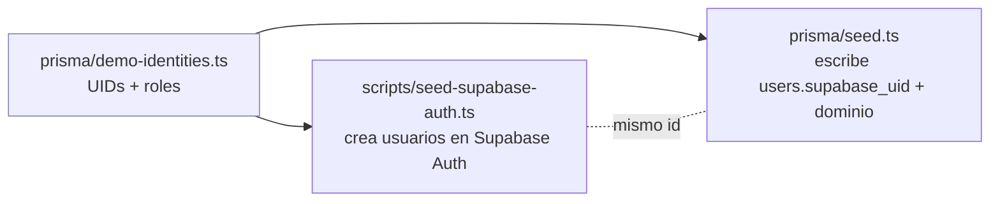

# Seed privada para testear el deploy

> Objetivo: poder loguear con cuentas demo en un entorno **deployado** para hacer smoke-test
> del deploy, **sin** exponer ese acceso a nadie más. Solo tú lo disparas y solo tú sabes la
> contraseña. Última revisión: 2026-06-14.

---

## 1. Por qué hace falta

`prisma/seed.ts` escribe en Postgres los usuarios demo con un `supabase_uid` determinista, pero
**no crea esos usuarios en Supabase Auth**. Como el login del deploy es 100% Supabase
(`SupabaseJwtStrategy` valida el JWT contra JWKS), sin el usuario en Auth **no puedes loguear**.

Esta seed cierra ese hueco con dos piezas que comparten una **única fuente de UIDs**
(`prisma/demo-identities.ts`), garantizando que el `id` en Supabase Auth = `supabase_uid` en Postgres:



El `role` se setea en `app_metadata.role` (minúscula: `teacher|student|parent`), que es justo lo que
lee `RolesGuard` vía `toRole()` → login **y** autorización quedan funcionando end-to-end.

---

## 2. Por qué es privada (solo para ti)

| Capa | Cómo te protege |
|---|---|
| **Sin endpoint** | No hay ninguna ruta HTTP de seed en la app. Cero superficie de ataque en prod. |
| **Trigger `workflow_dispatch`** | `.github/workflows/seed-prod.yml` no tiene push/cron. Solo **colaboradores del repo** (tú) lo pueden correr desde la pestaña Actions. |
| **Contraseña secreta** | Los emails (`*@innova.demo`) son predecibles, pero la password vive en el secret `SEED_DEMO_PASSWORD`. Sin ella nadie entra. **No está en el repo.** |
| **Guard `ALLOW_SEED=1`** | El script se niega a correr sin esa variable → evita ejecuciones accidentales. |
| **Confirm `SEED`** | El workflow exige tipear `SEED` a mano antes de correr. |
| **(Opcional) Environment `prod`** | Si configuras el environment `prod` con *required reviewers = tú*, agrega una aprobación manual extra. |

---

## 3. Secret que debes crear (una sola vez)

📍 `https://github.com/vruizz22/innova-backend-serverless/settings/secrets/actions`

| Secret | Valor | Notas |
|---|---|---|
| `SEED_DEMO_PASSWORD` | una contraseña fuerte que solo tú sepas (≥8 chars) | será la password de **todas** las cuentas demo |

Los demás ya existen (los del deploy): `DATABASE_URL`, `SUPABASE_URL`, `SUPABASE_SERVICE_ROLE_KEY`.

```bash
gh secret set SEED_DEMO_PASSWORD --repo vruizz22/innova-backend-serverless
# pega el valor cuando lo pida (no queda en el historial del shell)
```

---

## 4. Cómo correrla

### Opción A — desde GitHub Actions (recomendada, la más privada)

1. Repo → **Actions** → workflow **"Seed prod (private)"** → **Run workflow**.
2. En `confirm` escribe `SEED`. Marca `run_migrations` solo si la DB aún no está migrada.
3. Run. El job: instala → `prisma generate` → (migra) → `seed:auth` (Supabase Auth) → `prisma db seed` (Postgres).

### Opción B — local contra prod (si prefieres tu máquina)

```bash
# usa las credenciales de PROD; el script no escribe nada sin ALLOW_SEED=1
cd innova-backend-serverless

ALLOW_SEED=1 \
SUPABASE_URL="https://<project>.supabase.co" \
SUPABASE_SERVICE_ROLE_KEY="<service-role-key>" \
SEED_DEMO_PASSWORD="<tu-password-demo>" \
pnpm seed:auth            # agrega --dry-run para ver qué haría sin tocar Auth

DATABASE_URL="<postgres-url-prod>" pnpm prisma db seed
```

> El script es **idempotente**: si el usuario ya existe, actualiza su password y lo confirma.
> Si un email demo ya existe en Auth con un `id` distinto al determinista, lo avisa (HTTP en el log)
> y debes borrar ese usuario en Supabase → Authentication → Users y re-correr.

---

## 5. Credenciales demo resultantes

Todas con la misma password (`SEED_DEMO_PASSWORD`):

| Email | Rol | UID |
|---|---|---|
| `teacher@innova.demo` | teacher | `…0001` |
| `student1@innova.demo` … `student5@innova.demo` | student | `…0011`–`…0015` |
| `parent@innova.demo` | parent | `…0021` |

Smoke-test del deploy:

1. Front (`https://app.superprofes.app`) → login con `teacher@innova.demo` + tu password.
2. O directo a la API: `POST https://api.superprofes.app/auth/login`? No — el login real lo hace
   **Supabase**, no el backend. Para probar la API: obtén un access token de Supabase
   (`POST {SUPABASE_URL}/auth/v1/token?grant_type=password` con `apikey: ANON_KEY`) y úsalo como
   `Authorization: Bearer` contra `GET /auth/me`, `GET /skills`, etc.

---

## 6. Verificación de los archivos nuevos (antes de commitear)

```bash
cd innova-backend-serverless
pnpm exec tsc --noEmit                 # tipado de todo el proyecto, incl. scripts/ y prisma/
ALLOW_SEED=1 SUPABASE_URL=https://x.supabase.co SUPABASE_SERVICE_ROLE_KEY=x \
  SEED_DEMO_PASSWORD=testtest pnpm seed:auth --dry-run   # imprime el plan, no llama a Auth
```

---

## 7. ⚠️ Caveats

- Si tu proyecto Supabase tiene un **trigger en `auth.users`** que fuerza `app_metadata.role` en signup
  (ver `docs/auth-integration-supabase.md` §8), podría pisar el rol que setea el script. Verifica el rol
  del usuario en Supabase → Authentication tras correr; si quedó mal, ajusta el trigger o el `app_metadata`.
- `prisma db seed` crea/upserta datos de dominio demo (org, curso, alumnos, alerts). Es seguro re-correr
  (todo es `upsert`), pero **no lo apuntes a una DB con datos reales** — es para entornos de prueba.
- No subas `SEED_DEMO_PASSWORD` a ningún `.env` commiteado.
